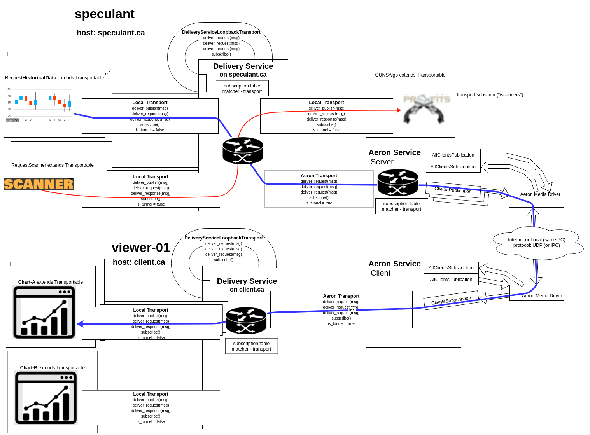

# delivery_service
Delivery Service is a prototype for the messaging between java instances.

All the participating classes are able to send/receive messages.
There are 3 messages types:  publish, request, response.
Each participating class should extend "Transportable".
Each participating class can subscribe by specifying a matcher in form of lambda function,
which takes currently routed message and return true if matcher f-n decides that message
meet subscription criteria or false otherwise.

Here's the example of subscribing to all the messages addressed to:"/scanners" virtual channel.

    ISubscriptionMatcher subscription_matcher = (Message message) -> message.headers.get("to").equals("/scanners");
    subscribe(subscription_matcher);

Note: each "Transportable" class should obtain it's own transport like this:

    transport = delivery_service.create_new_transport(this, TransportType.LOCAL);

This will also create 3 default subscriptions on the delivery_service side:
  - "/broadcast"
  - "/local/broadcast"
  - "your-transportable-instance-uri"   <-- this will allow to send request messages directly to your transportable instance

Btw, a "channel" is just any unique string and the "virtual" means it does not correspond
to any one particular recipient, but rather a logical group as by "topic".

Here's the example of creating and sending publish message:

    String from = get_uri();
    String to = "/scanners";
    String body = "Some body of the message... Body can be any java Object (String, Array etc.)";
    Message message = Message.create_new_publish(from, to, body);
    publish(message);

And the example of creating request message:

    from = get_uri();
    to = "client_1";
    body = "Private request from client_0 to client_1 goes here. . .";
    Message request_message = Message.create_new_request(from, to, body);
    send_request(request_message);

All the messages delivered to our class will be placed into the synchronized List<Message> incoming_messages_queue and it is your instance responsibility to extract messages and process them.
Example of incoming message processing:

    // Check our "inbox"
    if (incoming_messages_queue.size() > 0) {
        System.out.println("my uri is: " + get_uri() + ", my incoming_messages_queue size: " + incoming_messages_queue.size());

        // Process all the messages form the "inbox"
        while (incoming_messages_queue.size() > 0) {
            // Take 1st message from the incoming_messages_queue
            Message incoming_message = incoming_messages_queue.remove(0);
            System.out.println(get_uri() + " processing message: " + incoming_message.to_json());

            // If we received the message having type "request", we could send back a response:
            if (incoming_message.headers.get("mime_type").equals(MessageHeaderMimeType.REQUEST)) {
                // Yes, got a request, sending response back to the origin
                String from = get_uri();
                String body = "Response to your request, which was: " + incoming_message.body;
                Message response_message = Message.create_new_response(from, body, incoming_message);
                send_response(response_message);
            }
        }
    }

Here's the example of sending the response message back to the original request sender.
Note: we don't explicitly specify "to:" header field, which we could do by seeting it to something like: incoming_message.headers.get("from");
the "to:" header value will be taken care of for us by the Message.create_new_response() factory (thus it require the 'original_request' argument):

    String from = get_uri();
    String body = "Response to your request, which was: " + incoming_message.body;
    Message response_message = Message.create_new_response(from, body, original_request);
    send_response(response_message);

todo: add more details here, generate javadoc.

<pre>
Some other somewhat useful links:

Gson User Guide
    https://sites.google.com/site/gson/gson-user-guide#TOC-Collections-Examples
    THIS PAGE HAS BEEN MOVED TO GITHUB:
    https://github.com/google/gson/blob/master/UserGuide.md

How to pass lambda as a parameter (used in public interface ISubscriptionMatcher):
    See: https://stackoverflow.com/questions/13604703/how-do-i-define-a-method-which-takes-a-lambda-as-a-parameter-in-java-8
    in particular: https://stackoverflow.com/a/13604748/7022062
    
How do I add a project as a dependency of another project?
    http://www.avajava.com/tutorials/lessons/how-do-i-add-a-project-as-a-dependency-of-another-project.html
    
Understanding Maven Version Numbers
    https://docs.oracle.com/middleware/1212/core/MAVEN/maven_version.htm
    
Singleton in Java
    https://www.baeldung.com/java-singleton

Java Constructors vs Static Factory Methods
    https://www.baeldung.com/java-constructors-vs-static-factory-methods

</pre>
